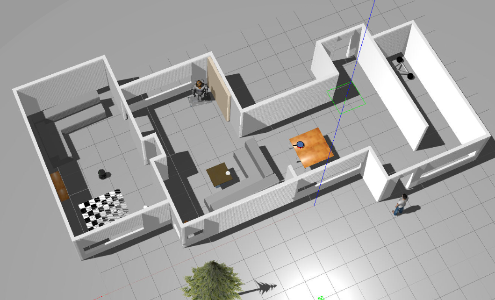
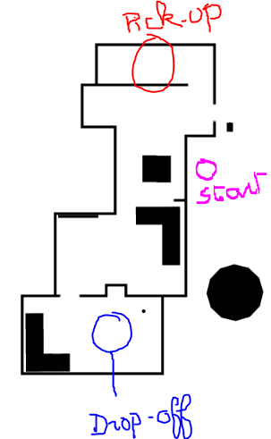
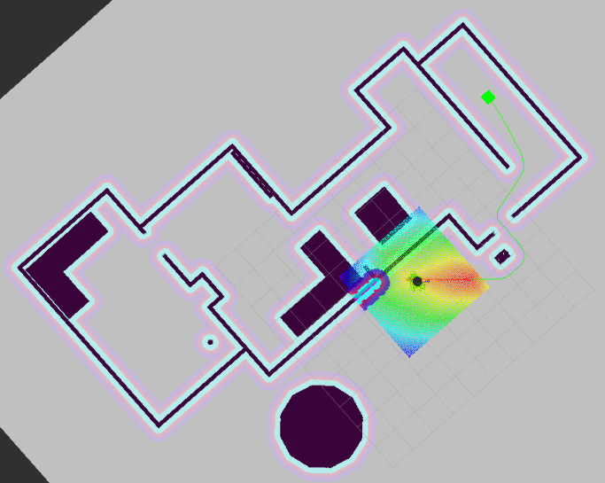
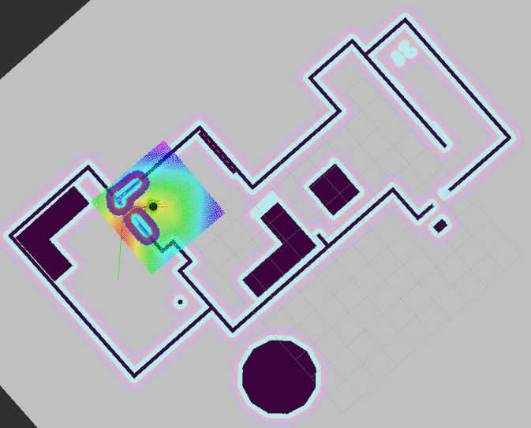

# RoboND-HomeServiceRobot
Udacity Robotics Nanodegree Project 5: Home Service Robot

In this project, we put together all modules that we have seen previously during the Software Engineer Robotics nanodegree: localization, mapping & navigation.

## Project steps:
- [x] Set up the simulation environment (using a custom world built in gazebo)
- [x] Test the robot navigation: `src/scripts/test_navigation.sh`
- [x] Test robot mapping through SLAM, leveraging an existing map provided as a PGM file: `src/scripts/test_slam.sh`
- [x] Test adding objects as markers & ensure the robot is able to dynamically find the best path: `src/scripts/pick_objects.sh` and `src/scripts/add_markers.sh`
- [x] Put it all together: `src/scripts/home_service.sh`

## Running the scripts
1. Clone this repo to be under `/home/workspace/` (i.e. `/home/workspace/RoboND-HomeServiceRobot/`
2. Start `roscore` in a specific terminal
3. Build the project by running `catkin_make` on the root directory of this repository
4. Launch the script of your choice under `src/scripts/`

## Results
Below are 2 views of the map used (gazebo view & top view):

The robot behaves as expected: it finds its path from the start to the pick-up zone, spends 5 seconds simulating the time to pick-up the object, then heads to the drop-off zone for delivery, the below RViZ captures shows the path planning from start to the pickup zone, as well as when the robot in on the road to delivery:

